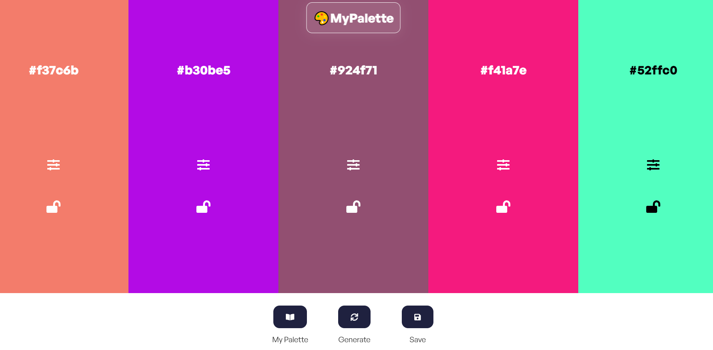

# MYPALETTE

# WHAT IS THIS ?
A easy to use color palette tool to explore, save, and generate color palettes of your choice!

## VIEW THIS HERE :
https://amazing-cheesecake-05c696.netlify.app/

## FEATURES
- Generate Random Colors: Discover new color schemes with a click of a button.
- Save Your Palette: Store your favorite color combinations for later use.
- View Saved Palettes: Access and manage your saved palettes effortlessly.
- User-Friendly Interface: Intuitive design that makes exploring color palettes a breeze.

